# Fluxograma do Sistema VOXY
## Arquitetura Multi-Agente com OpenAI Agents SDK + LiteLLM

> Sistema multi-agente com **VOXY Orchestrator** (Claude Sonnet 4.5) + **5 Subagentes especializados** (Translator, Corrector, Weather, Calculator, Vision) utilizando **OpenAI Agents SDK v0.2.8 + LiteLLM Multi-Provider** com 400+ modelos configuráveis.

---

## 📊 Diagrama de Fluxo Principal

```mermaid
flowchart TB
    Start([Usuário envia mensagem]) --> Entry{Ponto de Entrada?}

    Entry -->|HTTP POST| HTTP["/api/chat/"]
    Entry -->|WebSocket| WS["/ws/{user_id}"]

    HTTP --> Auth[Autenticação JWT<br/>+ JTI Validation]
    WS --> Auth

    Auth -->|Falha| RememberMeCheck{Remember Me<br/>Credentials?}
    Auth -->|Sucesso| JTICheck[Redis JTI Check<br/>Token Blacklisting]

    RememberMeCheck -->|Sim| AutoLogin[Auto-login Attempt<br/>7-day credentials]
    RememberMeCheck -->|Não| AuthFail[Retorna 401 Unauthorized]

    AutoLogin -->|Sucesso| JTICheck
    AutoLogin -->|Falha| AuthFail

    JTICheck -->|Blacklisted| AuthFail
    JTICheck -->|Valid| VisionRL{Tem image_url?}

    VisionRL -->|Sim| RateLimitCheck[Vision Rate Limiter<br/>- check_upload_rate_limit<br/>- check_cost_limits]
    VisionRL -->|Não| SessionCheck

    RateLimitCheck -->|Limite excedido| RateLimitFail[Retorna Rate Limit Error]
    RateLimitCheck -->|OK| SessionCheck[Criar/Obter Session ID]

    SessionCheck --> SaveUserMsg[Salvar mensagem do usuário<br/>SupabaseIntegration.save_message]

    SaveUserMsg --> CacheCheck{Cache Redis?}

    CacheCheck -->|HIT| CacheResponse[Retorna resposta em cache<br/>+ metadata cached=true]
    CacheCheck -->|MISS| VOXYSystem[VOXYSystem.chat<br/>message, user_id, session_id, image_url]

    VOXYSystem --> VOXYOrch[VOXY Orchestrator<br/>🆕 LiteLLM Multi-Provider<br/>Default: Claude Sonnet 4.5<br/>400+ models via .env]

    VOXYOrch --> VisionCheck{image_url + <br/>_is_vision_request?}

    %% DUAL-PATH ARCHITECTURE
    VisionCheck -->|✅ Sim - PATH 1 BYPASS| VisionBypass[🎯 PATH 1: VISION BYPASS<br/>Direct Vision Agent<br/>7-8s with post-processing]
    VisionCheck -->|Não| ProcessMsg[Processar mensagem<br/>com image_url tag]

    ProcessMsg --> PrepareMsg{image_url presente?}
    PrepareMsg -->|Sim| AddImageTag["Adiciona tag:<br/>IMAGEM PARA ANÁLISE: url"]
    PrepareMsg -->|Não| RunnerCall

    AddImageTag --> RunnerCall[Runner.run<br/>voxy_agent, message, session]

    VisionBypass --> VisionDirect[Vision Agent - analyze_image<br/>- Determina analysis_type<br/>- Determina detail_level]

    VisionDirect --> VisionCache{Vision L1/L2<br/>Cache Hit?}

    VisionCache -->|HIT| VisionCacheHit[Retorna VisionAnalysisResult<br/>from cache + cache metadata]
    VisionCache -->|MISS| VisionRateLimit[_check_rate_limits<br/>10/min, 50/hour]

    VisionRateLimit --> AdaptiveReason[Adaptive Reasoning<br/>determine_reasoning_effort<br/>- minimal/low/medium/high]

    AdaptiveReason --> LiteLLMCall[🆕 OpenAI Agents SDK + LiteLLM<br/>Runner.run agent, messages<br/>LitellmModel multimodal<br/>400+ models configurable]

    LiteLLMCall --> BuildResult[🆕 Build VisionAnalysisResult<br/>Extract from Runner result<br/>_extract_cost_from_runner_result]

    BuildResult --> StoreVisionCache[Armazena em L1+L2 Cache<br/>TTL adaptativo]

    StoreVisionCache --> PostProcessCheck{ENABLE_VISION_<br/>POSTPROCESSING?}

    PostProcessCheck -->|True| PostProcess[🆕 _conversationalize_vision_result<br/>GPT-4o-mini lightweight<br/>Technical → Conversational<br/>~1-2s overhead]
    PostProcessCheck -->|False| DirectReturn[Retorna analysis técnica diretamente]

    PostProcess --> ConversationalResponse[Resposta conversacional<br/>+ tools_used array: vision]
    DirectReturn --> TechnicalResponse[Resposta técnica<br/>+ tools_used array: vision]

    ConversationalResponse --> FinalResponse
    TechnicalResponse --> FinalResponse

    %% VOXY ORCHESTRATOR DECISION PATH (PATH 2)
    RunnerCall --> VOXYDecision{VOXY Analisa<br/>Mensagem}

    VOXYDecision -->|Tradução| TranslateTool["@function_tool<br/>translate_text<br/>→ Translator Agent"]
    VOXYDecision -->|Correção| CorrectTool["@function_tool<br/>correct_text<br/>→ Corrector Agent"]
    VOXYDecision -->|Clima| WeatherTool["@function_tool<br/>get_weather<br/>→ Weather Agent"]
    VOXYDecision -->|Cálculo| CalcTool["@function_tool<br/>calculate<br/>→ Calculator Agent"]
    VOXYDecision -->|Imagem no texto| VisionTool["@function_tool<br/>analyze_image<br/>→ Vision Agent SYNC"]
    VOXYDecision -->|Busca web| WebTool["@function_tool<br/>web_search"]
    VOXYDecision -->|Geral| DirectResponse[Responde diretamente<br/>sem subagente]

    %% SUBAGENTS PROCESSING
    TranslateTool --> TranslatorAgent[Translator Agent<br/>LiteLLM Multi-Provider<br/>400+ models via .env]
    CorrectTool --> CorrectorAgent[Corrector Agent<br/>LiteLLM Multi-Provider<br/>400+ models via .env]
    WeatherTool --> WeatherAgent[Weather Agent<br/>LiteLLM Multi-Provider<br/>400+ models via .env]
    CalcTool --> CalculatorAgent[Calculator Agent<br/>LiteLLM Multi-Provider<br/>400+ models via .env]
    VisionTool --> VisionToolCall[🆕 Vision Agent - process_tool_call<br/>SYNCHRONOUS with nest_asyncio<br/>Returns formatted string<br/>9-10s via orchestrator]
    WebTool --> WebSearch[Web Search<br/>Placeholder]

    WeatherAgent --> WeatherAPI["get_weather_api<br/>OpenWeatherMap API<br/>httpx.get"]

    WeatherAPI --> WeatherFormat[Formata resultado<br/>temperatura, descrição]

    TranslatorAgent --> SubagentReturn[Retorna resultado<br/>para VOXY]
    CorrectorAgent --> SubagentReturn
    WeatherFormat --> SubagentReturn
    CalculatorAgent --> SubagentReturn
    VisionToolCall --> SubagentReturn
    WebSearch --> SubagentReturn
    DirectResponse --> CompileResponse

    SubagentReturn --> CompileResponse[VOXY compila resposta final<br/>🆕 + tools_used metadata extracted]

    CompileResponse --> DRYModels[🆕 Build Response Models<br/>api/models.py<br/>MessageResponse + metadata]

    DRYModels --> FinalResponse[Resposta Final + Metadata<br/>- agent_type<br/>- tools_used array<br/>- processing_time<br/>- vision_metadata if used]

    FinalResponse --> SaveAssistant[Salvar resposta assistant<br/>SupabaseIntegration.save_message<br/>🆕 + tools_used persisted]

    SaveAssistant --> StoreCache[Armazenar em Redis Cache<br/>cache_agent_response<br/>🆕 + tools_used in cache]

    StoreCache --> UpdateUsage{Vision usado?}

    UpdateUsage -->|Sim| IncrementUsage[increment_usage<br/>Vision Rate Limiter]
    UpdateUsage -->|Não| ReturnResponse

    IncrementUsage --> ReturnResponse[Retorna ChatResponse<br/>- response<br/>- session_id<br/>- request_id<br/>- 🆕 tools_used<br/>- vision_metadata]

    CacheResponse --> ReturnFinal[Retorna ao usuário]
    ReturnResponse --> ReturnFinal
    AuthFail --> ReturnFinal
    RateLimitFail --> ReturnFinal

    ReturnFinal --> End([FIM])

    style VisionBypass fill:#ff6b6b,color:#fff
    style VisionDirect fill:#ff6b6b,color:#fff
    style VisionCache fill:#ff6b6b,color:#fff
    style LiteLLMCall fill:#ff6b6b,color:#fff
    style BuildResult fill:#ff9f43,color:#fff
    style PostProcess fill:#ff9f43,color:#fff
    style VisionToolCall fill:#ff9f43,color:#fff
    style TranslatorAgent fill:#4ecdc4,color:#fff
    style CorrectorAgent fill:#4ecdc4,color:#fff
    style WeatherAgent fill:#4ecdc4,color:#fff
    style CalculatorAgent fill:#4ecdc4,color:#fff
    style VOXYOrch fill:#ffd93d,color:#000
    style Auth fill:#a8dadc,color:#000
    style CacheCheck fill:#95e1d3,color:#000
```

### 🔑 Legenda do Fluxo Principal

**Pontos de Entrada**:
- **HTTP POST** `/api/chat/` - API REST síncrona
- **WebSocket** `/ws/{user_id}` - Conexão real-time bidirecional

**Autenticação & Segurança**:
- **JWT + JTI Validation** - Token baseado em claims com JTI tracking
- **Redis Token Blacklisting** - Invalidação de tokens em logout
- **Remember Me System** - Auto-login com credenciais persistentes (7 dias)

**Dual-Path Architecture (Vision)**:
- **PATH 1 (Bypass)**: `image_url` + keywords → Vision Agent direto (7-8s)
- **PATH 2 (Orchestrator)**: URL no texto → VOXY decide via `@function_tool` (9-10s)

**Cache Layers**:
- **L1 Cache**: In-memory cache para Vision Agent (session-scoped)
- **L2 Cache**: Redis cache para responses gerais + Vision results

**Subagentes Especializados** (via `@function_tool`):
- **Translator**: Tradução multilingual (LiteLLM Multi-Provider)
- **Corrector**: Correção ortográfica/gramatical (LiteLLM Multi-Provider)
- **Weather**: Consulta clima via OpenWeatherMap API (LiteLLM Multi-Provider)
- **Calculator**: Cálculos matemáticos complexos (LiteLLM Multi-Provider)
- **Vision**: Análise multimodal de imagens (OpenAI Agents SDK + LiteLLM)

**Persistência**:
- **Supabase**: Armazenamento de mensagens (user + assistant) + `tools_used`
- **Redis**: Cache de responses + Vision results + Token blacklisting

---

## 🧪 Diagrama de Fluxo: Teste Isolado de Subagentes

### 🔑 Legenda do Fluxo de Testes

**Entry Points**:
- **CLI**: `scripts/test_agent.py` - Modo interativo, benchmark, export (JSON/CSV)
- **HTTP API**: `POST /api/test/subagent` - RESTful API para testes automatizados

**Bypass Features**:
- **Direct Loading**: Pula VOXY Orchestrator → reduz overhead de 18x (37s → 2s)
- **Cache Control**: Flag `bypass_cache=true` para forçar re-execução
- **Rate Limit Control**: Flag `bypass_rate_limit=true` para testes intensivos

**Performance Gains**:
- **Standard Agents**: 37s via orchestrator → **2s** isolado (**18x faster**)
- **Vision Agent**: 37s via orchestrator → **7-8s** isolado (**5x faster**)

**Output Formats**:
- **JSON**: Structured output para parsing programático + file export
- **CSV**: Spreadsheet-ready para análise de dados em Excel/Sheets
- **ANSI**: Rich terminal output com cores e tabelas (CLI)
- **HTTP**: REST API response com Pydantic models (`api/models.py`)

**Testing Workflow**:
1. Request → Entry point (CLI ou HTTP)
2. Validation → argparse/Pydantic
3. Direct Load → Bypass orchestrator overhead
4. Config Load → Environment variables via `models_config.py`
5. LiteLLM Check → Factory pattern ou Native SDK
6. Agent Instantiation → Direct constructor call
7. Execution → `analyze_image()` (Vision) ou `Runner.run()` (Standard)
8. Performance Measurement → `time.perf_counter()` + cost tracking
9. Result Building → TestResult with metadata (tokens, cost, cache_hit)
10. Format Response → JSON/CSV/ANSI/HTTP
11. Return Results → Performance metrics + response data

---

**Versão**: v2.4 (2025-10-09) | **Status**: 100% Operacional ✅
