# Diagrama de Fluxo: Teste Isolado de Subagentes + VOXY Orchestrator

Sistema de testes isolados permitindo testar **6 agentes** (5 subagentes + VOXY Orchestrator) via CLI interativo, comandos diretos e HTTP REST API, com bypass do fluxo completo de autenticação para debug rápido.

---

## 🧪 Diagrama de Fluxo: Teste Isolado de Subagentes + VOXY Orchestrator

```mermaid
flowchart TB
    TestStart([Test Request]) --> TestEntry{Entry Point?}

    TestEntry -->|CLI| CLI["scripts/test_agent.py<br/>🆕 6 agentes: translator, corrector,<br/>weather, calculator, vision, voxy<br/>--interactive mode<br/>--benchmark --export"]
    TestEntry -->|HTTP| HTTPTest["POST /api/test/subagent<br/>🆕 agent_name: voxy supported<br/>input_data: message + image_url<br/>bypass_cache, bypass_rate_limit"]

    CLI --> ParseArgs[Parse CLI Arguments<br/>argparse + validation<br/>🆕 voxy subparser added]
    HTTPTest --> ValidateReq[Validate Request<br/>Pydantic TestSubagentRequest<br/>🆕 voxy routing added]

    ParseArgs --> AgentType{Agent Type?}
    ValidateReq --> AgentType

    AgentType -->|🆕 voxy| VOXYTest[VOXY Orchestrator Test<br/>test_voxy_orchestrator<br/>Full orchestration + session<br/>~5s standard queries]
    AgentType -->|Standard 5| DirectLoad[Direct Subagent Load<br/>BYPASS VOXY Orchestrator<br/>18x speedup: 37s to 2s]

    %% VOXY ORCHESTRATOR PATH (NEW)
    VOXYTest --> VOXYInit[Initialize VOXYSystem<br/>+ 5 subagents registered<br/>+ Vision Agent integrated]

    VOXYInit --> VOXYConfig[Load Orchestrator Config<br/>load_orchestrator_config<br/>Claude Sonnet 4.5 default]

    VOXYConfig --> VOXYBypass{Bypass Options?}

    VOXYBypass -->|Vision bypass_cache| ClearVisionCache[Clear Vision L1 cache<br/>vision_agent.vision_cache.clear]
    VOXYBypass -->|Vision bypass_rate_limit| ResetRateLimits[Reset rate limit counters<br/>requests_in_current_minute = 0]
    VOXYBypass -->|No bypass| VOXYExecute

    ClearVisionCache --> VOXYExecute[VOXYSystem.chat<br/>message, user_id, session_id<br/>🆕 image_url support<br/>Full orchestration flow]
    ResetRateLimits --> VOXYExecute

    VOXYExecute --> VOXYDecision{VOXY Decision<br/>Path?}

    VOXYDecision -->|PATH 1| VisionBypass[Vision Bypass<br/>7-8s direct analysis]
    VOXYDecision -->|PATH 2| VOXYTools[Tool Selection<br/>translate, correct, weather,<br/>calculate, analyze_image]

    VisionBypass --> VOXYResult
    VOXYTools --> VOXYResult[Build TestResult<br/>+ tools_used array<br/>+ subagents_invoked<br/>+ orchestrator metadata]

    VOXYResult --> VOXYPerf[Performance Metrics<br/>processing_time<br/>cost estimation<br/>session tracking]

    %% STANDARD SUBAGENTS PATH (EXISTING)
    DirectLoad --> LoadConfig["Load agent config<br/>from models_config.py<br/>env vars + defaults"]

    LoadConfig --> LiteLLMCheck{Uses LiteLLM?}

    LiteLLMCheck -->|Yes| LiteLLMFactory["Create LiteLLM model<br/>LiteLLM Multi-Provider<br/>400+ models available"]
    LiteLLMCheck -->|No| NativeModel[Native OpenAI SDK<br/>Legacy subagents]

    LiteLLMFactory --> InstantiateAgent[Instantiate Subagent<br/>Direct constructor call<br/>Create Agent instance]
    NativeModel --> InstantiateAgent

    InstantiateAgent --> VisionCheck{Vision Agent?}

    VisionCheck -->|Yes| VisionExec[Vision: analyze_image<br/>async method<br/>bypass cache/rate limit optional]
    VisionCheck -->|No| StandardExec[Standard: Runner.run<br/>OpenAI Agents SDK<br/>formatted_input]

    VisionExec --> MeasurePerf[Measure Performance<br/>time.perf_counter<br/>+ cost tracking]
    StandardExec --> MeasurePerf

    MeasurePerf --> BuildResult[Build TestResult<br/>success, response, metadata<br/>tokens, cost, cache_hit]

    VOXYPerf --> FormatResponse{Response Format?}
    BuildResult --> FormatResponse

    FormatResponse -->|CLI JSON| CLIJson[JSON output<br/>--export results.json<br/>file export]
    FormatResponse -->|CLI CSV| CLICSV[CSV output<br/>--export results.csv<br/>spreadsheet ready]
    FormatResponse -->|CLI ANSI| CLIAnsi[ANSI colored output<br/>Rich formatting<br/>🆕 Tool usage stats<br/>table display]
    FormatResponse -->|HTTP| HTTPJson[HTTP JSON Response<br/>TestSubagentResponse model<br/>api/models.py]

    CLIJson --> TestEnd([Performance Results<br/>🆕 VOXY: ~5s orchestration<br/>Standard: 37s to 2s - 18x<br/>Vision: 37s to 7-8s - 5x<br/>Bypass cache: Optional])
    CLICSV --> TestEnd
    CLIAnsi --> TestEnd
    HTTPJson --> TestEnd

    style VOXYTest fill:#ffd93d,color:#000
    style VOXYInit fill:#ffd93d,color:#000
    style VOXYExecute fill:#ffd93d,color:#000
    style VOXYResult fill:#ffd93d,color:#000
    style DirectLoad fill:#ff6b6b,color:#fff
    style LiteLLMFactory fill:#4ecdc4,color:#fff
    style InstantiateAgent fill:#4ecdc4,color:#fff
    style MeasurePerf fill:#95e1d3,color:#000
    style BuildResult fill:#a8dadc,color:#000
```



---

## 🔑 Legenda do Fluxo de Testes

**Entry Points**:
- **CLI**: `scripts/test_agent.py` - 🆕 6 agentes (5 + voxy), modo interativo, benchmark, export (JSON/CSV)
- **HTTP API**: `POST /api/test/subagent` - 🆕 RESTful API com suporte a voxy orchestrator

**Agentes Testáveis** (6 total):
1. **translator** - Tradução multilingual (Standard)
2. **corrector** - Correção ortográfica (Standard)
3. **weather** - Consulta clima (Standard)
4. **calculator** - Cálculos matemáticos (Standard)
5. **vision** - Análise multimodal (Standard + Cache)
6. **🆕 voxy** - VOXY Orchestrator completo (Orchestration + Session)

**Bypass Features**:
- **Direct Loading** (Standard 5): Pula VOXY Orchestrator → reduz overhead de 18x (37s → 2s)
- **🆕 Full Orchestration** (voxy): Executa fluxo completo sem autenticação → ~5s
- **Cache Control**: Flag `bypass_cache=true` para forçar re-execução (Vision + VOXY)
- **Rate Limit Control**: Flag `bypass_rate_limit=true` para testes intensivos (Vision + VOXY)

**Performance Gains**:
- **🆕 VOXY Orchestrator**: Teste direto sem UI/auth → **~5s** (orchestration completa)
- **Standard Agents**: 37s via orchestrator → **2s** isolado (**18x faster**)
- **Vision Agent**: 37s via orchestrator → **7-8s** isolado (**5x faster**)

**Output Formats**:
- **JSON**: Structured output para parsing programático + file export (`--export results.json`)
- **CSV**: Spreadsheet-ready para análise de dados em Excel/Sheets (`--export results.csv`)
- **🆕 ANSI**: Rich terminal output com cores, tabelas + tool usage stats (CLI)
- **HTTP**: REST API response com Pydantic models (`api/models.py`)

**Testing Workflow - Standard Agents** (5 agentes):
1. Request → Entry point (CLI ou HTTP)
2. Validation → argparse/Pydantic
3. Direct Load → Bypass orchestrator overhead
4. Config Load → Environment variables via `models_config.py`
5. LiteLLM Check → Factory pattern ou Native SDK
6. Agent Instantiation → Direct constructor call
7. Execution → `analyze_image()` (Vision) ou `Runner.run()` (Standard)
8. Performance Measurement → `time.perf_counter()` + cost tracking
9. Result Building → TestResult with metadata (tokens, cost, cache_hit)
10. Format Response → JSON/CSV/ANSI/HTTP
11. Return Results → Performance metrics + response data

**🆕 Testing Workflow - VOXY Orchestrator**:
1. Request → Entry point (CLI ou HTTP) com `agent_name=voxy`
2. Validation → `message` (required), `image_url` (optional)
3. Initialize VOXYSystem → 5 subagentes + Vision Agent registered
4. Load Orchestrator Config → `load_orchestrator_config()` (Claude Sonnet 4.5)
5. Bypass Options → Cache/Rate limit control (Vision)
6. Execute Orchestration → `VOXYSystem.chat()` - Full flow
7. VOXY Decision → PATH 1 (Vision Bypass) ou PATH 2 (Tool Selection)
8. Build TestResult → + `tools_used[]`, `subagents_invoked[]`, orchestrator metadata
9. Performance Metrics → processing_time, cost, session tracking
10. Format Response → JSON/CSV/ANSI/HTTP (com tool usage stats)
11. Return Results → Orchestration metrics + subagent tracking

---

## 🚀 Exemplos de Uso: Teste do VOXY Orchestrator

### CLI - Teste Direto

**Tradução via orchestrator**:
```bash
poetry run python scripts/test_agent.py voxy \
  --message "Traduza 'Hello world' para português"

# Output esperado:
# ✅ TEST SUCCESS
# 💬 Response: A tradução de "Hello world" para português é: Olá mundo 🌍
# 📊 Metadata:
#    Agent:           voxy
#    Model:           openrouter/anthropic/claude-sonnet-4.5
#    Processing Time: 4.996s
#    Tools:           translate_text
```

**Análise multimodal (Vision Agent via orchestrator)**:
```bash
poetry run python scripts/test_agent.py voxy \
  --message "Qual emoji é este?" \
  --image-url "https://example.com/emoji.png"

# Output: Análise via PATH 1 (Vision Bypass) ou PATH 2 (Tool Selection)
```

---

### CLI - Benchmark Mode

**Estatísticas de performance + tool usage**:
```bash
poetry run python scripts/test_agent.py voxy \
  --message "Quanto é 2+2?" \
  --benchmark --iterations 5

# Output:
# ⏱️  Timing Statistics: Min/Max/Average/Total
# 💰 Cost Statistics: Min/Max/Average/Total
# 🔧 Tools Usage:
#    calculate: 5 times
```

---

### CLI - Modo Interativo

**Teste interativo com prompts**:
```bash
poetry run python scripts/test_agent.py --interactive

# Prompts:
# Enter agent name: voxy
# 📋 VOXY Orchestrator
#   Test strategy: orchestrator_direct
#   Required params: message
#   Optional params: image_url
#
#   message: Traduza "Hello" para francês
#   image_url (optional): [Enter]
#
# ✅ TEST SUCCESS
# 💬 Response: La traduction de "Hello" en français est: Bonjour
```

---

### CLI - Export Results

**Exportar para JSON/CSV**:
```bash
# Export JSON
poetry run python scripts/test_agent.py voxy \
  --message "Clima em São Paulo" \
  --export results.json

# Export CSV
poetry run python scripts/test_agent.py voxy \
  --message "Corrija 'Ola mundo'" \
  --export results.csv
```

---

### HTTP REST API

**Test VOXY Orchestrator via API**:
```bash
# POST /api/test/subagent
curl -X POST http://localhost:8000/api/test/subagent \
  -H "Content-Type: application/json" \
  -d '{
    "agent_name": "voxy",
    "input_data": {
      "message": "Traduza Hello para português"
    },
    "bypass_cache": true
  }'

# Response 200:
{
  "success": true,
  "agent_name": "voxy",
  "response": "A tradução de 'Hello' para português é: Olá",
  "metadata": {
    "processing_time": 2.5,
    "model_used": "openrouter/anthropic/claude-sonnet-4.5",
    "tools_used": ["translate_text"],
    "subagents_invoked": ["translator"],
    "cost": 0.000525
  }
}
```

**Test com imagem (Vision)**:
```bash
curl -X POST http://localhost:8000/api/test/subagent \
  -H "Content-Type: application/json" \
  -d '{
    "agent_name": "voxy",
    "input_data": {
      "message": "Analise esta imagem",
      "image_url": "https://example.com/image.jpg"
    },
    "bypass_cache": true,
    "bypass_rate_limit": true
  }'
```

---

### Listar Agentes Disponíveis

**Ver todos os 6 agentes testáveis**:
```bash
poetry run python scripts/test_agent.py --list

# Output:
# Available Agents
# ================
# translator    - Model: openrouter/google/gemini-2.5-flash
# corrector     - Model: openrouter/google/gemini-2.5-flash
# weather       - Model: openrouter/openai/gpt-4o-mini
# calculator    - Model: openrouter/x-ai/grok-code-fast-1
# vision        - Model: openrouter/anthropic/claude-sonnet-4.5
# voxy          - Model: openrouter/anthropic/claude-sonnet-4.5
#                 Strategy: orchestrator_direct
#                 Capabilities: Multi-agent orchestration,
#                              Intelligent tool selection, ...
```

---

**Versão**: v2.5 (2025-10-10) | **Status**: 100% Operacional ✅
**Última Atualização**: Sistema de Testes Isolados - VOXY Orchestrator
